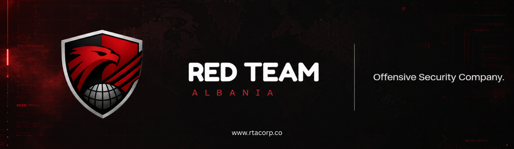

  

<h3 align="center">Offensive security services for organizations across the Western Balkans.</h3>

  <a href="https://www.rtacorp.co">Website</a> &nbsp;|&nbsp;
  <a href="mailto:admin@rtacorp.co">Contact</a> &nbsp;|&nbsp;
  <a href="https://linkedin.com/company/red-team-albania">LinkedIn</a> &nbsp;|&nbsp;
  <a href="https://www.instagram.com/rtacorp.co">Instagram</a>

 

## About

Red Team Albania (RTA) is a practitioner-led offensive security company based in Tirana, Albania. We were founded to close the gap between checkbox compliance and genuine adversarial testing in a region that has been underserved by serious offensive security capability.

Every engagement is run by the people scoped to the work, not handed off to junior analysts operating under a brand name. The site and the service are built the same way: clear structure, hard evidence, and reporting your team can actually use.

| | |
|---|---|
| **Tirana** | Based in Albania, serving the Western Balkans |
| **5 service lines** | Red teaming, penetration testing, threat intelligence, research, and academy |
| **Published research** | Technical work and presentations inform the practice |
| **Direct operators** | No account layer between clients and the people doing the work |

## What We Do

| Service | Focus |
|---|---|
| **Red Teaming** | Objective-based adversary simulation that tests detection, response, and escalation paths as a real attacker would. |
| **Penetration Testing** | Manual, practitioner-led assessment of web applications, APIs, cloud environments, and internal networks. |
| **Threat Intelligence** | Actor tracking, dark-web monitoring, and strategic briefings mapped to real, relevant threats. |
| **Research** | Original vulnerability research, CVE coordination, and technical findings published beyond client delivery. |
| **RTA Academy** | Training programs, CTF events, and internships built to grow offensive security talent in the region. |

## Why Red Team Albania

- **Direct operator access** - clients work with the people running the engagement, not a handoff layer.
- **Evidence-led reporting** - findings include the path, the impact, and the remediation logic.
- **Regional threat context** - work is tuned to Western Balkans and adjacent enterprise risk.
- **Method, not theater** - manual analysis, clean scoping, and a debrief the client's team can use.

Compliance aware, research backed, and free of the noisy upsell that comes with reselling security products.

## Engagement Process

1. **Scoping and rules of engagement** - NDA, scoping questionnaire, and an agreed RoE define targets, exclusions, and escalation paths before execution begins.
2. **Reconnaissance** - attack surface mapping, OSINT, and target profiling under the agreed scope.
3. **Execution** - manual exploitation, privilege escalation, and lateral movement toward the agreed objectives, with evidence captured at each step.
4. **Reporting and debrief** - findings include reproduction detail, impact, and a remediation path, walked through with the client's team.
5. **Retest** - fixed findings are re-verified against the original attack path so closure is proven, not assumed.

## RTA Academy

The RTA Academy exists because security education in the Western Balkans has lagged behind the threat landscape. Its programs reflect real attack techniques, real tooling, and real-world scenarios rather than theoretical frameworks.

- **Training Programs** - structured, hands-on security training from fundamentals to advanced offensive techniques.
- **CTF Challenges** - Capture The Flag events designed by RTA practitioners, run as open community competitions and for conferences, universities, and companies.
- **Internship Program** - a practitioner-mentored internship for students and early-career security professionals working on real offensive security projects.

## Team

| Name | Role | Focus | GitHub |
|---|---|---|---|
| Orgito Leka | Co-Founder, Security Researcher | Vulnerability research, penetration testing, reverse engineering, AI/MCP security | [github.com/orgito1015](https://github.com/orgito1015) |
| Mateos Xhukellari | Backend Developer | Backend engineering, API and platform security, infrastructure, automation | [github.com/MateosXhukellari](https://github.com/MateosXhukellari) |
| Alki Leka | Co-Founder, Hardware Security | Hardware security, embedded systems, IoT security, firmware reverse engineering, physical penetration testing | [github.com/4lk1](https://github.com/4lk1) |

## Responsible Disclosure

We run a responsible disclosure program covering rtacorp.co and any subdomains operated by Red Team Albania SHPK, including our public website and admin console. Third-party services we use, and any client engagement environment governed by a separate agreement, are out of scope.

To report a vulnerability, email a clear description, reproduction steps, and impact assessment to **admin@rtacorp.co**. Full policy details are published on our [disclosure page](https://www.rtacorp.co/disclosure).

## Contact

| | |
|---|---|
| **Email** | admin@rtacorp.co |
| **Location** | Tirana, Albania |
| **Response time** | Within one business day |

---

  Red Team Albania SHPK - Tirana, Albania - Western Balkans coverage

